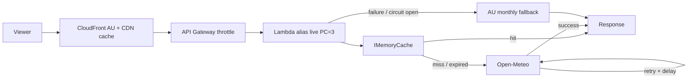

# Weather API — Architecture & Delivery Plan

Living document for the DevOps take-home: **C# API**, **AWS (Terraform)**, **CI/CD**, **defence in depth**. Update this file as decisions change.

**ADRs:** We will create **Architecture Decision Records** under [`design/adr/`](./design/adr/) to capture settled choices (context, options, trade-offs, consequences). Keep §18 in sync: when a decision is made, add or update an ADR and reflect the outcome in this document.

---

## 1. Goals & scope

| Item | Decision |
|------|-----------|
| **Endpoint** | `GET /weather?city={city}` |
| **Success body** | `{ "city", "tempC", "condition", "source", "correlationId" }` — **`correlationId`** matches **`X-Correlation-Id`** (§11.3). **`source`**: `"live"` \| `"fallback"` (or header-only for `source` — pick one and keep consistent). |
| **Geography** | **Australia-only** product scope: supported cities / validation / Open-Meteo resolution restricted or filtered to AU (document exact rule: allowlist vs `country=AU`). |
| **Live provider** | **Open-Meteo** (HTTPS). |
| **Non-goals (v1)** | No WAF; no real `terraform apply` required in repo (plan/validate in CI is enough). **Feature flags:** see §10 (`USE_OPEN_METEO`, `MAINTENANCE_MODE`). |

---

## 2. System context (high level)

```text
Viewer
  → CloudFront (AU geo restriction, CDN cache)
  → API Gateway (throttling; optional REST stage cache — see §7.3)
  → Lambda .NET 8 on alias `live` (provisioned concurrency = 3, in-process cache)
       → Open-Meteo (retries, timeouts, circuit breaker)
       → AU monthly fallback table (on failure)
```



**Diagrams (repo):** same figure as [diagrams/01-system-context.md](./diagrams/01-system-context.md) (edit there for standalone Mermaid).

---

## 3. Traffic & edge

### 3.1 CloudFront

| Concern | Approach |
|---------|-----------|
| **TLS** | HTTPS viewer → HTTPS origin (API Gateway). Enforce modern TLS on distribution. |
| **AU-only viewers** | **Geo restriction:** `whitelist` location **`AU`** (no WAF). Non-AU → **403** at edge. |
| **CDN cache** | Cache **successful** `GET /weather` responses. **Cache key must include** query string **`city`** (whitelist in cache policy). |
| **TTL** | Short (e.g. **1–5 minutes**); align with HTTP `Cache-Control` and Lambda mem TTL (§7). |
| **Origin** | API Gateway (execute-api or custom domain). |
| **Errors** | Origin returns **`Cache-Control: no-store`** for **4xx/5xx** so failures are not edge-cached. |

**Staging:** Document a **second distribution** or relaxed geo for CI / overseas reviewers.

### 3.2 API Gateway

| Concern | Approach |
|---------|-----------|
| **Protocol** | **HTTP API** (simpler) **or** **REST API** if you require **native stage response cache** (§7.3). |
| **Throttling** | **Stage** burst + steady-state RPS → global ceiling, protects Lambda and Open-Meteo. |
| **Integration** | Invoke Lambda **alias `live`** ARN (required for stable **provisioned concurrency**). |

---

## 4. Compute — Lambda

### 4.1 Configuration (Terraform variables)

| Parameter | Purpose / notes |
|-----------|------------------|
| **Runtime** | .NET 8 (`dotnet8` or container — pick one stack). |
| **Architecture** | `arm64` vs `x86_64` (document choice; arm64 common for cost). |
| **Memory** | Affects CPU; start e.g. **256–512 MB**, tune with cold/warm profiling. |
| **Timeout** | Must cover **worst-case Open-Meteo path** (per-attempt timeout × attempts + margin); stay **under API Gateway integration limit** (~29s on many setups). |
| **Environment variables** | Feature flags, base URLs, retry counts, breaker thresholds, log level, etc. |
| **Ephemeral storage** | Default unless large `/tmp` needed. |

### 4.2 Cold starts — provisioned concurrency

| Item | Decision |
|------|-----------|
| **Goal** | **Mitigate .NET cold starts** under typical concurrency. |
| **Mechanism** | **Provisioned concurrency = 3** on **published version + alias `live`**. |
| **IaC** | `aws_lambda_alias` + `aws_lambda_provisioned_concurrency_config` (`qualifier` = alias name). |
| **Integration** | API Gateway targets **alias-qualified** function ARN, not `$LATEST`. |
| **Trade-off** | **Baseline cost**; brief transition during version bumps. |

**Scaling clarification:** Lambda **auto-scales** concurrency with load. **Provisioned concurrency** keeps **N warm environments**; additional traffic uses **on-demand** environments (possible cold start unless N increased). **Optional later:** Application Auto Scaling policy on provisioned concurrency (not required for fixed “3 warm”).

### 4.3 IAM

Least privilege: **CloudWatch Logs** + **VPC-less** outbound HTTPS to Open-Meteo only (add SSM etc. only if used).

---

## 5. Resilience — retries (Open-Meteo) — full specification

Outbound calls to Open-Meteo use **bounded retries with delay** so transient blips recover without hanging the user or hammering the provider.

### 5.1 Goals

| Goal | How |
|------|-----|
| **Survive transients** | Retry on timeouts and **5xx** (and optionally **429** with backoff / `Retry-After`). |
| **Fail fast on client errors** | **No** retries on **4xx** from Open-Meteo (bad request, auth, etc.). |
| **Avoid sync storms** | **Exponential backoff + full jitter** between attempts. |
| **Bounded worst-case latency** | Cap **attempt count** and **per-attempt timeout**; sum must fit **Lambda timeout** and product SLO. |
| **Cooperative cancellation** | Stop retrying when the **incoming API** `CancellationToken` fires. |

### 5.2 Retryable vs non-retryable

| Outcome | Retry? | Notes |
|---------|--------|--------|
| **HttpRequestException**, DNS, connection reset | **Yes** | Treat as transient for first N attempts. |
| **TaskCanceledException** from **HttpClient** per-attempt timeout | **Yes** | Distinguish from **user cancel** (see §5.7). |
| **502**, **503** | **Yes** | Classic transient upstream. |
| **429** | **Conditional** | Prefer: honour **`Retry-After`** (seconds) capped to a max; if header missing, use same backoff as other retries **once** or **skip** second retry on 429 — **document chosen rule**. |
| **401**, **403**, **404**, other **4xx** | **No** | Map to logs + **fallback** or hard error per product rule (Open-Meteo 404 for unknown coords is not fixed by retrying the same payload). |
| **200** but **invalid JSON** / schema mismatch | **No** | **Defensive path:** treat as provider failure → **fallback** (not infinite retry). |

### 5.3 Attempt model (counting)

- **Total attempts** = **1 initial + R retries** (e.g. **R = 2** → **3** HTTP calls max).  
- **Retries** = **delays between** attempts (after attempt 1 fails, **wait**, then attempt 2, etc.).  
- **No infinite loops**; R is a **small integer** from config (`WEATHER_HTTP_MAX_RETRIES` or similar).

**Default numbers (edit in Terraform/env; document in README):**

| Symbol | Example value | Meaning |
|--------|----------------|--------|
| `R` | `2` | Max **retries** after first failure (**3** total attempts). |
| `T_attempt` | `1500` ms | **Per-attempt** `HttpClient` timeout (each try gets its own budget). |
| `base_delay` | `100` ms | Base for exponential backoff. |
| `max_delay` | `1500` ms | Cap on computed delay between attempts. |
| `jitter` | **full** | Delay uniform in `[0, computed]` (or `full` between `0.5×` and `1.5×` — pick one formula and stick to it). |

### 5.4 Delay between attempts (exponential backoff + jitter)

Between attempt `k` and `k+1` (where `k` starts at **0** after first failure):

1. **Exponential component (uncapped):** `raw = base_delay * 2^k` milliseconds.  
2. **Cap:** `capped = min(raw, max_delay)`.  
3. **Full jitter (recommended):** `sleep_ms = random_uniform(0, capped)` (or use Polly’s built-in jitter options that approximate this).  

**Why jitter:** Many Lambdas retrying the same outage at the same instant creates a **thundering herd**; jitter spreads load on Open-Meteo and your own concurrency.

**Example** (`base_delay=100`, `max_delay=1500`, R=2):

| After failure # | k | uncapped `raw` | `capped` | sleep (conceptual) |
|-----------------|---|------------------|----------|---------------------|
| 1st failure | 0 | 100 ms | 100 ms | random in `[0, 100]` ms |
| 2nd failure | 1 | 200 ms | 200 ms | random in `[0, 200]` ms |

(If you use **3** total attempts, there are **at most two** inter-attempt sleeps.)

### 5.5 Policy ordering (.NET / Polly)

Recommended pipeline (conceptual; innermost first):

1. **Overall** respect incoming **`CancellationToken`**.  
2. **Per-attempt timeout** on the HTTP call (**`T_attempt`** each try).  
3. **Retry policy** wraps the call: on retryable outcome, **await delay** (§5.4), then next attempt.  
4. **Circuit breaker** (§6) is typically **around** the retry policy **per process** so an open circuit **short-circuits before** opening new HTTP attempts (avoid sleeping through a known outage — optional ordering nuance: **breaker before retry** for cross-request open state; **retry inside** a single request when breaker is closed).

**Implementation options:** `HttpClient` + **Polly** v8 pipelines, or **`IHttpClientBuilder.AddStandardResilienceHandler`** with tuned retry + attempt timeout — align with .NET 8 project template choices.

### 5.6 Logging and metrics (each attempt)

Log **structured fields** (no secrets):

- `attempt` (1-based), `max_attempts`, `delay_ms` (if retrying), `http_status` (if any), `outcome` (`success`, `retry`, `give_up`).  
- On give-up: log **`OpenMeteoGiveUpReason`** enum for fallback correlation.

Emit a **metric counter** `open_meteo_http_attempts_total` (labels: `result=success|retry|failure`) if you add metrics in v1 or document for later.

### 5.7 CancellationToken — measures (full)

Cooperative cancellation is a **first-class** part of resilience: stop work promptly when the **caller disconnects**, avoid burning Lambda time and Open-Meteo quota, and **never** treat “client gone” as a transient HTTP failure worth retrying.

#### 5.7.1 Token sources (what can cancel work)

| Source | Typical token in ASP.NET Core | Intended effect |
|--------|------------------------------|-----------------|
| **HTTP client disconnect** | `HttpContext.RequestAborted` | User closed tab, mobile OS killed app, load balancer idle timeout, API Gateway/Lambda **upstream disconnect** when client goes away. |
| **Host shutdown** | `IHostApplicationLifetime.ApplicationStopping` | Graceful drain on deploy / scale-in (less critical for short Lambda invocations, still good practice in generic host code). |
| **Your own deadline** | `CancellationTokenSource.CreateLinkedTokenSource(userToken, timeoutToken)` | Combine **user abort** with a **server-side overall budget** stricter than Lambda’s hard kill. |

**Primary rule:** the **outbound Open-Meteo pipeline** (HTTP + retry sleeps + JSON parse) must observe **one linked token** derived from **`RequestAborted`** (see §5.7.3).

#### 5.7.2 End-to-end propagation (required plumbing)

1. **Minimal API / controller** — accept `CancellationToken cancellationToken` (injected per-request by the framework = **`RequestAborted`**).  
2. **Application / domain services** — pass **`CancellationToken`** through **every** `async` method that does I/O (`GetWeatherAsync(..., ct)`), no “fire and forget” without token.  
3. **`HttpClient` calls** — always use overloads that accept **`CancellationToken`**: `GetAsync(uri, ct)`, `SendAsync(request, ct)`, `ReadAsStringAsync(ct)` (API surface dependent on version/extension).  
4. **Polly / resilience** — configure policies so retries, attempt timeouts, and circuit-breaker waits use **`ct`** (or a **linked** token) so **aborted requests do not sleep through backoff**.  
5. **CPU-only work** — if parsing large JSON, periodically check **`ct.ThrowIfCancellationRequested()`** or pass token into `JsonSerializer` options where applicable; for small payloads this is optional but documented.

#### 5.7.3 Linked tokens (user abort + per-attempt timeout + optional overall cap)

**Pattern:** create **`CancellationTokenSource`** instances with clear ownership (`using`) and **link**:

- **`userCt`** = `HttpContext.RequestAborted` (caller disconnect).  
- **`attemptTimeoutCt`** = per-HTTP-attempt timeout (often via **`CancellationTokenSource.CreateLinkedTokenSource(userCt)`** + `CancelAfter(T_attempt)` **per attempt**, disposed after each attempt).  
- **Optional `overallCt`** = overall budget for the whole weather resolution (e.g. max **8 s** end-to-end before fallback even if retries would allow more on paper).

**Linked CTS example (conceptual):**

```text
overall = Link(user: RequestAborted, timeout: OverallBudget)
  foreach attempt:
    attemptCts = Link(overall, CancelAfter(T_attempt))
    await http.SendAsync(..., attemptCts.Token)
    dispose attemptCts
dispose overall
```

**Dispose rule:** dispose **`CancellationTokenSource`** objects to avoid timer/socket leaks (especially `CancelAfter` sources).

#### 5.7.4 Backoff / delay between retries must be cancellable

- **`await Task.Delay(delayMs, cancellationToken)`** (or Polly’s delay that accepts **`ct`**).  
- If **`ct`** fires during the delay: **abort remaining retries**, **do not** start another HTTP call, exit to **fallback policy** or propagate cancel per §5.7.6.  
- **Never** use `Thread.Sleep` or untokenized `Task.Delay` in the hot path.

#### 5.7.5 `TaskCanceledException` vs `OperationCanceledException` vs timeouts

| Observation | Typical meaning | Action |
|---------------|-----------------|--------|
| **`OperationCanceledException`** where **`CancellationToken.IsCancellationRequested`** and token is **`RequestAborted`** | Client / host cancelled | **No retry.** Do not increment “transient failure” counters for circuit breaker (optional: separate metric `client_cancelled`). |
| **`TaskCanceledException`** on **`HttpClient`** when **`HttpClient.Timeout`** fires (often inner `TaskCanceledException`) | **Per-attempt** timeout | **Retry** if policy allows (§5.2), unless **user** token already cancelled — check **user** token first. |
| **Canceled after linked `CancelAfter`** | Distinguish **which** linked source fired (user vs attempt vs overall) via **state inspection** or **separate try/catch scopes** per attempt. |

**Defensive classification:** if unsure whether cancel was **user** vs **HttpClient.Timeout**, prefer: **if `RequestAborted.IsCancellationRequested` → treat as user cancel** (no retry); else treat as attempt timeout (retryable).

#### 5.7.6 API behaviour when cancelled (customer + ops)

| Layer | Behaviour |
|-------|-----------|
| **Outbound work** | Stop retries; cancel in-flight HTTP; **do not** call Open-Meteo again for this invocation. |
| **Response to client** | If the **client already disconnected**, you may not be able to send bytes — still **stop work** to save cost. If cancel happens **before** response started, return **499** (non-standard but used for “client closed request”) **or** propagate as **408/499** — **pick one** and document for API Gateway. |
| **Logging** | Log at **Information** or **Debug** with `event=client_cancelled`, `correlation_id`, **not** as `Error` (avoids false incident pages). |
| **Fallback** | **Product choice:** on client cancel, **usually do not** compute fallback for a response nobody will read — **short-circuit** and return. If business requires audit-only fallback logging, document explicitly. |

#### 5.7.7 Lambda + API Gateway nuances

- API Gateway / Lambda can still run briefly after the viewer disconnects depending on integration; **`RequestAborted`** is still the right signal **when the ASP.NET Core host surfaces it**.  
- Do not rely on “Lambda will be killed at N seconds” as your **only** cancellation — still use **`RequestAborted`** + **your own budgets** so work stops earlier when possible.

#### 5.7.8 Tests (prove cancellation is wired)

| Test | Pass criteria |
|------|----------------|
| **Client cancels mid-flight** | Use **`CancellationTokenSource`** in test; cancel after **first** HTTP handler invocation; assert **no second** HTTP call (or no second attempt after cancel during delay). |
| **Cancel during backoff** | First attempt fails transiently; cancel **`ct`** while **`Task.Delay`** backoff is pending; assert pipeline **exits** without further attempts. |
| **Overall budget exceeded** | Linked overall token fires; assert **fallback** or **abort** per spec without unbounded wait. |

### 5.8 Worst-case latency formula (for Lambda timeout)

Let `A = R + 1` be total attempts, `T` = `T_attempt` ms per attempt, `D` = sum of **max** possible delays between attempts.

`worst_case_ms ≈ A * T + D` (plus negligible handler overhead).

**Example:** A=3, T=1500ms, two delays each ≤1500ms → about **3×1500 + 2×1500 = 7500 ms** upper bound before fallback. Set **Lambda timeout** safely above this (e.g. **10–15 s**) and below API Gateway limits.

### 5.9 Configuration (Terraform → Lambda env)

| Env var (example) | Purpose |
|-------------------|---------|
| `WEATHER_HTTP_MAX_RETRIES` | R (retries after first attempt). |
| `WEATHER_HTTP_ATTEMPT_TIMEOUT_MS` | `T_attempt`. |
| `WEATHER_HTTP_BACKOFF_BASE_MS` | `base_delay`. |
| `WEATHER_HTTP_BACKOFF_MAX_MS` | `max_delay`. |
| `WEATHER_HTTP_RETRY_ON_429` | `true`/`false` + behaviour with `Retry-After`. |
| `WEATHER_RESOLUTION_DEADLINE_MS` | *(optional)* Hard **end-to-end** budget for live resolution (linked with **`RequestAborted`**); after this, **abort retries** and take **fallback** or cancel per §5.7.6. |

### 5.10 Interaction with circuit breaker and fallback

```text
Request in
  → RequestAborted / linked overall deadline? → short-circuit (§5.7.6; no further HTTP)
  → circuit open? → fallback (no HTTP)
  → else attempt 1 … on retryable failure → cancellable delay → attempt 2 → …
  → all attempts exhausted OR non-retryable → fallback (or hard error per 4xx policy)
```

Retries **do not replace** fallback: they **narrow the window** where users see fallback for **short** provider glitches.

---

## 6. Resilience — circuit breaker

| Item | Specification |
|------|----------------|
| **Purpose** | After repeated failures, **stop calling** Open-Meteo for a **cool-down** window → fast **fallback**, reduced blast radius on provider outage. |
| **Interaction with retries** | Retries apply **within a single request**; breaker applies **across requests**. |
| **Open / half-open** | Document thresholds (failures per window, duration open, probe behaviour). |
| **When open** | Skip live call → **fallback** immediately + structured log reason **`CircuitOpen`**. |

---

## 7. Caching — all levels

Align **TTLs** and **cache keys** (at minimum **normalized `city`**; include **`source`** or separate cache rules if live vs fallback must not be confused).

### 7.1 HTTP (response semantics)

| Item | Specification |
|------|----------------|
| **Headers** | **`Cache-Control`** on success (e.g. `public, max-age=…`); optional **`s-maxage`** for shared caches. |
| **ETag** | Optional: conditional `GET` / **304**; must change when payload meaningfully changes. |
| **Errors** | **`Cache-Control: no-store`** on **4xx/5xx**. |
| **Fallback** | Document: **`no-store`** vs short `max-age` if fallback responses may be cached at CDN. |

### 7.2 CDN (CloudFront)

| Item | Specification |
|------|----------------|
| **What** | Cache **200** responses for `GET /weather?city=…` **only if** compatible with **`correlationId` in JSON** (§11.3.7). If id is per-request in body, **do not** share-cache that path at CloudFront without mitigating wrong-id risk. |
| **Key** | Query string **`city`** in cache key (whitelist). |
| **Policy** | Cache policy + origin request policy (forward minimal headers/query strings). |
| **Correlation note** | Per-request **`correlationId` in body** conflicts with **shared** edge cache for same `city` — follow **§11.3.7** (typically **no CDN body cache** for `/weather`). |

### 7.3 API Gateway cache (“API level”)

| Option | Notes |
|--------|--------|
| **REST API + stage cache** | True **managed cache at the API tier** (TTL, cache key settings). Use if you want this layer **literally** in API Gateway. |
| **HTTP API** | **No** equivalent first-class response cache → implement “API-origin” caching in **Lambda** (`IMemoryCache`) and/or rely on **CloudFront**. |

**Decision (fill in):** `HTTP API + Lambda memo` **vs** `REST API + stage cache` — record here: _______________________

### 7.4 In-process memory (`IMemoryCache`)

| Item | Specification |
|------|----------------|
| **Where** | Inside Lambda. |
| **Key** | e.g. `weather:{normalizedCity}` or include **`yyyyMM`** if fallback month matters for memoization. |
| **TTL** | Short (e.g. **30–120 s**) to **dedupe** Open-Meteo on **CDN miss** / concurrent misses. |
| **Limitation** | **Per execution environment**; not shared across all Lambdas — **CloudFront** is the shared layer. |

---

## 8. Defensive programming — fallback (no live data)

When Open-Meteo is **unreachable**, **invalid**, or **circuit is open** (after bounded retries where applicable):

| Item | Specification |
|------|----------------|
| **Response shape** | Same **weather** fields as a happy live response so clients do not break, **plus** **`correlationId`** on **every** JSON response (§11.3). |
| **Data** | **Precomputed AU “typical for calendar month”** per **`(city, month)`** (median-style **`tempC`** + representative **`condition`**). |
| **Unknown city** | Document: **national AU default row** vs **400** — pick one. |
| **Transparency** | **`source: "fallback"`** (or header); README states data is **climatological**, not “live now”. |
| **HTTP status** | **200** for best UX on read-only weather widgets (document if you ever choose **503** for strict consumers). |
| **Logging / metrics** | Structured **reason** (`Timeout`, `5xx`, `InvalidBody`, `CircuitOpen`, …); **no** stack traces or upstream bodies to clients. |

---

## 9. Security (no WAF)

| Control | Where |
|---------|--------|
| **AU viewers** | CloudFront **geo whitelist `AU`**. |
| **Rate limiting** | **API Gateway stage throttling** (global). Optional: **per-IP** limiting in app using forwarded client IP — document **trust** (only if CloudFront cannot be bypassed or add a **secret header** between CF and origin if needed). |
| **Input validation** | `city` length, charset, allowlist / AU resolution rules. |
| **Secrets** | Not in repo; Lambda env from Terraform; production path = SSM / Secrets Manager (future). |

---

## 10. Feature toggles & configuration

Two **independent** flags (Lambda env from Terraform; future: SSM / AppConfig). **Do not** overload one flag to mean both “kill Open-Meteo” and “go dark.”

### 10.1 Environment variables (names)

| Env var | Type | Meaning |
|---------|------|---------|
| **`USE_OPEN_METEO`** | `true` / `false` | **`true`:** call Open-Meteo (retries, breaker, fallback on failure). **`false`:** **never** call Open-Meteo; serve **AU monthly fallback** (or static table) only — **kill-switch for the provider**, API **stays up**. |
| **`MAINTENANCE_MODE`** | `true` / `false` | **`true`:** **service maintenance** — do not serve normal weather business (typically **`503`** + ProblemDetails or small JSON body); **no** Open-Meteo calls. **`false`:** normal routing. |

**Read pattern:** Prefer **`IOptionsSnapshot`** or **`IOptionsMonitor`** (or reload-friendly provider) so Terraform/env updates take effect on **new** Lambda environments without implying mid-request flips.

### 10.2 Combination matrix (truth table)

**Rule:** Evaluate **`MAINTENANCE_MODE` first**. If maintenance is on, **`USE_OPEN_METEO` is ignored.**

| `MAINTENANCE_MODE` | `USE_OPEN_METEO` | HTTP | Open-Meteo | Response |
|--------------------|------------------|-------|------------|----------|
| `true` | `true` | **503** (recommended) | **No** | Maintenance payload only (no live/fallback weather contract — document body). |
| `true` | `false` | **503** | **No** | Same as above (`USE_OPEN_METEO` irrelevant). |
| `false` | `true` | **200** / **4xx** per validation | **Yes** (resilience stack §5–§6) | Live + **`source=live`**, or fallback + **`source=fallback`** on failure. |
| `false` | `false` | **200** / **4xx** per validation | **No** | Fallback table only; **`source=fallback`** (or `static` if you split naming — pick one). |

**CDN / cache:** Maintenance **`503`** responses should use **`Cache-Control: no-store`** at origin so CloudFront does not cache “maintenance” as if it were weather.

### 10.3 When to flip which plug (runbook)

| Incident / intent | Flip |
|-------------------|------|
| Open-Meteo down, bad data, quota, compliance pause | **`USE_OPEN_METEO=false`** — API **up**, **no** upstream. |
| Security incident, fatal bug, legal “go dark”, planned maintenance | **`MAINTENANCE_MODE=true`** — **no** normal product traffic semantics (503). |
| Healthy operations | **`MAINTENANCE_MODE=false`**, **`USE_OPEN_METEO=true`** (or `false` if you intentionally run fallback-only). |

### 10.4 Other configuration (same section)

| Source | Use |
|--------|-----|
| **Terraform / Lambda env** | Retry/backoff (§5.9), breaker thresholds, log level, Open-Meteo base URL, **`WEATHER_RESOLUTION_DEADLINE_MS`** (optional). |
| **Future** | SSM Parameter Store / AppConfig for **flip without redeploy** + audit. |

**Interface:** App code depends on **`IOptions`/abstractions** (e.g. `IFeatureFlags`, `IWeatherDataSource`), not raw env reads scattered in controllers.

**Implementation sketch:** Middleware or first delegate: if **`MAINTENANCE_MODE`** → short-circuit **503**; else invoke weather pipeline respecting **`USE_OPEN_METEO`**.

---

## 11. Observability

### 11.1 Logging — pluggable abstraction (swap implementations)

**Primary abstraction (recommended):** **`Microsoft.Extensions.Logging.ILogger<TCategory>`** (or **`ILogger`** with explicit category). This is the **.NET standard** pipeline: **`ILogger` → `ILoggerProvider` → sinks** (Console, Debug, **Serilog**, **OpenTelemetry**, etc.). **Business code never references** Serilog/NLog/AWS SDK types directly.

| Rule | Why |
|------|-----|
| **Inject `ILogger<T>`** (or `ILoggerFactory.CreateLogger`) into services / handlers | Enables testing with **`NullLogger`**, **`FakeLogger`**, or **` Xunit`** `ITestOutputHelper` wrappers without filesystem or cloud. |
| **Single composition root** (`Program.cs` / `WebApplicationBuilder`) owns provider registration | **Swapping loggers = change DI registration only** (one place), not controllers or domain. |
| **Optional thin façade** | Only if you need a **vendor-neutral** API beyond `ILogger` (e.g. `IWeatherDiagnostics` with domain-shaped methods). Prefer **`ILogger` + well-chosen categories** (`Weather.OpenMeteo`, `Weather.Fallback`) to avoid extra interfaces. |

**How to “swap it out” in practice**

| Target | Mechanism |
|--------|-----------|
| **Built-in JSON / console** (Lambda default) | `builder.Logging.AddJsonConsole()` or `ConfigureLogging` + formatter suitable for **CloudWatch Logs Insights**. |
| **Serilog** | `builder.Host.UseSerilog((ctx, cfg) => cfg.ReadFrom.Configuration(ctx.Configuration))` and `AddSerilog` / replace default providers — sinks: **Console** (Lambda → CloudWatch), file (local only), Seq (dev). |
| **OpenTelemetry** | `AddOpenTelemetry().WithLogging()` exporting to OTLP / future vendor — same **`ILogger`** in app code. |
| **Tests** | `services.AddLogging(b => b.AddXUnit(...))` or `NullLogger<T>.Instance`. |

**Anti-patterns:** `Console.WriteLine`, static loggers, **`LogInformation($"..." + city)`** without structured placeholders (hurts queries and can leak uncontrolled strings).

---

### 11.2 Log levels — policy (several levels, consistent use)

Map **`Microsoft.Extensions.Logging.LogLevel`** to **operational meaning** so teams do not debate every line in review.

| Level | When to use | Prod default (typical) |
|-------|-------------|-------------------------|
| **Trace** | Per-tick internals, message payloads (dangerous) | **Off** |
| **Debug** | Branch decisions, cache hit/miss, retry attempt **numbers**, breaker state transitions | **Off** in prod; **On** in dev/staging |
| **Information** | **Request boundary**: accepted request (correlation id, city, outcome `live`/`fallback`), successful completion, **maintenance / kill-switch** mode entered | **On** |
| **Warning** | **Degraded but served**: retries exhausted → fallback, slow Open-Meteo latency above SLO, **invalid provider payload** recovered via fallback, rate-limit approaching | **On** |
| **Error** | **Handled** exception paths where user still got a response (e.g. unexpected bug in mapping) **or** invariant violated after mitigation | **On** |
| **Critical** | Process-level failure before request pipeline can respond (rare in Lambda per invocation) | **On** |

**Feature-flag note:** **`MAINTENANCE_MODE`** short-circuit should log at **Information** (expected ops), not **Error**.

---

### 11.3 Correlation ID & structured logging

Every **request** gets **one canonical correlation identifier** that appears in **all logs**, **scopes**, **downstream HTTP calls** (where useful), **response headers** (for customer support), and aligns with **tracing** (`Activity`/OpenTelemetry) when enabled.

#### 11.3.1 Canonical **CorrelationId** (single id per request)

| Rule | Specification |
|------|----------------|
| **Name** | **`CorrelationId`** in log scopes and JSON fields; HTTP header **`X-Correlation-Id`** (or team standard — document once). |
| **Generation** | **First middleware** in the pipeline (immediately after security primitives if any): if inbound **`X-Correlation-Id`** / **`X-Request-Id`** is present and **passes validation** (length, charset, e.g. **1–128** visible ASCII), **use it**; else **generate** a new id (**GUID** without braces, or **ULID** — pick one). |
| **Uniqueness** | **One id per incoming HTTP request**; never reuse across requests. |
| **Stability** | Same value for the **entire** server-side handling of that request (including **all retries** to Open-Meteo for that invocation). |

#### 11.3.2 Where it must appear (checklist)

| Sink | Requirement |
|------|-------------|
| **Every log line** for the request | **`ILogger` scope** (see below) so **all** categories (`Weather.*`, `Microsoft.AspNetCore.*`) inherit **`CorrelationId`** without passing parameters through every method (still pass **`CancellationToken`**). |
| **Structured JSON** | Each log event includes **`CorrelationId`** as a **top-level or scoped** property (Serilog enricher from scope, or JSON formatter scope export). |
| **HTTP response headers** | Echo **`X-Correlation-Id: {id}`** on **every** response (`200`, `400`, `503`, maintenance) so proxies and clients can read it without parsing the body. |
| **HTTP response JSON bodies** | Include **`"correlationId": "<id>"`** on **every** JSON payload, **same value** as the header: **`200`** weather success (`city`, `tempC`, `condition`, `source`, `correlationId`), **`400`** validation errors, **`503`** maintenance payloads, and **`ProblemDetails`** / RFC7807 bodies (**`correlationId`** as a top-level field or inside **`extensions`** — **pick one** and use consistently). |
| **Outbound Open-Meteo `HttpClient`** | Add **`X-Correlation-Id`** (and optionally **`traceparent`** when using W3C trace context) on **each** attempt so provider support can correlate (Open-Meteo may ignore — harmless). |
| **Metrics** | **Do not** attach raw **`CorrelationId`** as a **high-cardinality** metric label (blows up cardinality/cost). Use **`Outcome`**, **`Path`**, **`Source`** (live/fallback). Link logs ↔ traces via **trace id** when OTel is on; use **exemplars** later if needed. |
| **Exceptions** | Global handler logs **`CorrelationId`** with the exception; ensure the **JSON error** sent to the client also contains **`correlationId`** (see row above — avoid “header only” for errors if support expects copy-paste from response JSON). |

#### 11.3.3 Secondary identifiers (optional scope fields)

These **supplement** **`CorrelationId`**; they are **not** substitutes for it.

| Field | Source | Use |
|-------|--------|-----|
| **`AwsRequestId`** | `ILambdaContext.AwsRequestId` (Lambda) | AWS Support / Lambda console correlation. |
| **`ApiGatewayRequestId`** | API Gateway header (e.g. `x-amzn-RequestId` / `X-Amzn-Trace-Id` variants — confirm for HTTP API) | Tie to API GW access logs if enabled later. |
| **`TraceId`** | `Activity.Current?.TraceId` when OpenTelemetry enabled | Join logs to traces in observability backend. |

Add all as **`BeginScope`** key-value pairs so structured sinks emit them consistently.

#### 11.3.4 Middleware & `BeginScope` (implementation contract)

1. **Early middleware** creates **`CorrelationId`**, assigns **`HttpContext.Items["CorrelationId"]`** (or `HttpContext.Features`), starts **`using (_logger.BeginScope(new Dictionary<string, object?> { ["CorrelationId"] = id, ["AwsRequestId"] = … }))`** for the rest of the pipeline.  
2. **`HttpContext.TraceIdentifier`:** optionally **set** to the same value (`Activity` / `TraceIdentifier` alignment) so Kestrel and distributed tracing share one story — **document** if you unify or keep separate **trace** vs **business correlation**.  
3. **Order:** correlation middleware **before** auth, weather handler, and **before** `UseSerilogRequestLogging` if used, so access logs include the id.

#### 11.3.5 CloudWatch Logs Insights

Example filter (adjust field names to your JSON envelope):

```sql
fields @timestamp, @message
| filter CorrelationId = "YOUR_ID_FROM_RESPONSE_HEADER_OR_JSON_BODY"
| sort @timestamp asc
```

All **retry attempts**, **fallback**, and **maintenance** paths for that request should appear under **one** `CorrelationId` query. Prefer **`correlationId`** from the **response JSON** or **`X-Correlation-Id`** header when triaging support tickets.

#### 11.3.6 Structured message templates & categories

| Item | Approach |
|------|-----------|
| **Templates** | `LogInformation("Weather resolved {CorrelationId} {Outcome} for {City} in {ElapsedMs}ms", …)` — **or** rely on scope-only **`CorrelationId`** and omit from message to avoid duplication; **pick one style** per codebase. |
| **Categories** | Type-based **`ILogger<OpenMeteoWeatherClient>`** — filter via `Logging:LogLevel:YourApp.Weather=Debug`. |

#### 11.3.7 CDN / cache interaction (important)

If **`correlationId`** is **unique per request** and embedded in the **JSON body**, a **shared edge cache** (CloudFront) keyed only on **`?city=`** will serve **stale bodies** to different clients — including **another user’s `correlationId`**. Mitigations (pick **one** and document in §7):

| Option | Behaviour |
|--------|-----------|
| **A — No CDN body cache for `/weather`** | CloudFront **forward all** to origin for that path, or **disable caching** for `GET /weather` while still caching static assets elsewhere. **Simplest** with **`correlationId` in body**. |
| **B — Cache key includes `correlationId`** | **Defeats** caching for anonymous public API (every hit unique) — **avoid** unless you only cache “anonymous” synthetic responses without id (not your case). |
| **C — `correlationId` header-only for cached tier** | Keep **`X-Correlation-Id`** for support; **omit `correlationId` from JSON** when serving from a shared cache — **two shapes** (bad DX) unless edge injects id (**Lambda@Edge** / **CloudFront Functions**) — usually **not** worth it for this take-home. |

**Recommendation for this project:** **Option A** for `GET /weather` if **`correlationId`** stays in the **JSON body**; keep **`Cache-Control`** / **CloudFront** story honest in §7.

---

### 11.4 Runtime configuration (Terraform / appsettings)

| Config key (examples) | Purpose |
|-----------------------|---------|
| `Logging__LogLevel__Default` | Baseline (e.g. `Information`). |
| `Logging__LogLevel__Microsoft` | Framework noise (often `Warning`). |
| `Logging__LogLevel__YourApp.Weather` | Tune **Weather** subsystem without redeploying code structure. |
| `Serilog:*` | If using Serilog, **minimum level overrides** per area (optional). |

Lambda env vars use **`__`** for nested configuration in .NET.

---

### 11.5 Security & data in logs

| Rule | Detail |
|------|--------|
| **No secrets** | Never log API keys, cookies, auth headers, full upstream URLs with embedded secrets. |
| **PII** | **`city`** is product data — acceptable at **Information**; avoid logging **full raw IP** unless required for abuse investigation (document retention). |
| **Upstream bodies** | Log **status + latency + truncated body hash** at **Debug** only, not full HTML/JSON from Open-Meteo in prod. |

---

### 11.6 Log destination (Lambda → AWS)

| Item | Approach |
|------|-----------|
| **Sink** | Lambda **stdout** → **CloudWatch Logs** log group (Terraform **`aws_cloudwatch_log_group`** + retention). |
| **Format** | **Single-line JSON** per event where possible (easier **Insights** queries than multi-line exceptions — use structured exception logging). |
| **Retention** | Set per env (e.g. **7–30 days** dev, **90+** prod if compliance requires). |

---

### 11.7 Metrics (brief)

Count **`live` vs `fallback` vs `maintenance` vs `kill_switch`**, Open-Meteo **attempts**, **latency histograms**, breaker state — **`System.Diagnostics.Metrics`** or **OpenTelemetry metrics** (see §11.8); same **composition-root** swap story as logs.

---

### 11.8 Tracing & OpenTelemetry (trade-offs for a 2-day repo)

**Goal:** One instrumentation story for **dependency latency** (Open-Meteo, retries) and **request path** (ASP.NET Core), aligned with **`correlationId`** / **`trace_id`** in logs (§11.3).

#### 11.8.1 Honest trade-offs (agreed scope)

| Approach | Upside | Downside |
|----------|--------|----------|
| **Full AWS ADOT Lambda layer** + **Application Signals** (or equivalent OTLP sink) wired entirely in **Terraform** | Strong **“production on AWS”** narrative; collector + exporter managed by AWS patterns | **Easy to burn time**: layer **ARN** / region matrix, **`AWS_LAMBDA_EXEC_WRAPPER`**, sampling rules, **IAM** least-privilege, first-deploy debugging |
| **OpenTelemetry in application code only** + **stdout → CloudWatch Logs** + **Terraform** `metric_filter` / alarms / **dashboard** (no ADOT layer in v1) | **Fast**; still proves you know **traces + metrics** APIs (`Activity`, `Meter`, `HttpClient` instrumentation) and **CloudWatch** operations as code | Trace backend may be **local OTLP** (Jaeger/Tempo in Docker) or **console** in CI unless you add more AWS wiring later |
| **Hybrid (recommended default for this take-home)** | **OTel tracing + metrics in C#** (`Program.cs`); **Terraform** for **`aws_cloudwatch_log_group`**, **`aws_cloudwatch_metric_filter`**, **`aws_cloudwatch_metric_alarm`**, **`aws_cloudwatch_dashboard`**, optional **SNS**; **README one-liner:** *“In production we’d attach the **ADOT Lambda layer** and export to **CloudWatch Application Signals**.”* | You must **say explicitly** what runs in the repo **vs** what is **documented only** so reviewers do not expect full ADOT in CI without credentials |

**Bottom line:** Do **not** let ADOT/IAM block shipping **tests + API + IaC plan**. Prefer **instrumentation in code** + **CloudWatch from logs/metrics in Terraform** first; **upgrade path** to ADOT + Application Signals is the interview story.

#### 11.8.2 What to instrument first (minimal useful set)

- **ASP.NET Core** incoming request (latency, status).  
- **`HttpClient`** to Open-Meteo (**per attempt** as span **event** or child span — pick one, stay consistent).  
- **Tags / attributes:** low-cardinality only on metrics (`Outcome`, `Source`); on spans **`city`** is acceptable for **AU-only** demo — avoid unbounded labels on **metrics**.  
- **Logs:** add **`TraceId`** (from `Activity.Current`) to **`ILogger` scope** alongside **`CorrelationId`** when OTel is enabled (§11.3.3).

#### 11.8.3 Relation to X-Ray

**X-Ray** can coexist with or be **superseded by** OTel depending on exporter choice. For v1, **either** document **X-Ray off** **or** enable Lambda `tracing_config` only if you will actually read traces — avoid **double** pay/complexity without value.

---

## 12. Infrastructure as Code (Terraform)

### 12.1 Resources (checklist)

- [ ] `aws_cloudfront_distribution` (+ cache / origin request policies; **geo restriction AU**).
- [ ] `aws_apigatewayv2_api` + routes (HTTP) **or** REST API + deployment + **optional stage cache**.
- [ ] `aws_lambda_function`, **`aws_lambda_alias`**, **`aws_lambda_provisioned_concurrency_config`** (alias-qualified integration; **§12.3** blue/green).
- [ ] *(optional, §12.3)* **`aws_lambda_alias`** **`routing_config`** for weighted canary **or** **`aws_codedeploy_app`** + **`aws_codedeploy_deployment_group`** (Lambda) + IAM for CodeDeploy.
- [ ] `aws_iam_role` / policy for Lambda.
- [ ] `aws_cloudwatch_log_group`.
- [ ] *(optional, §11.8)* **`aws_cloudwatch_metric_filter`**, **`aws_cloudwatch_metric_alarm`**, **`aws_cloudwatch_dashboard`**, **`aws_sns_topic`** for demo alarms.
- [ ] *(§12.4)* **`env/*.tfvars`** (or equivalent) for **per-environment** inputs; remote **state key** per environment when using a backend.
- [ ] Variables: region, prefixes, TTLs, throttle limits, **provisioned concurrency = 3**, **`USE_OPEN_METEO`**, **`MAINTENANCE_MODE`**, retry-related **app** vars (§5.9), **`Logging__LogLevel__*`** (§11.4).
- [ ] Outputs: **CloudFront domain** (primary URL), useful debug outputs.

### 12.2 State / CI

- Local / CI: **`terraform init -backend=false`** when no remote backend is configured.
- **Remote state (when using real `apply`):** separate **state key or prefix per environment** (e.g. `weather/dev/terraform.tfstate`, `weather/prod/terraform.tfstate`); use a **DynamoDB lock table** (or equivalent) so concurrent applies do not corrupt state.
- CI default: **`validate`** + **`plan`** (no AWS credentials required with `-backend=false`).
- **`apply`:** optional; use AWS credentials appropriate to the team (§13.1) — not required for a self-contained repo.

### 12.3 Blue / green releases (Terraform)

Blue/green here means: ship a **new Lambda version** (“green”), **verify**, then move **production traffic** off the old version (“blue”) with **fast rollback** by reverting the **alias** (or weights), **without** renaming DNS at CloudFront if API Gateway keeps pointing at the **same alias ARN**.

#### 12.3.1 What Terraform owns

| Piece | Role |
|-------|------|
| **`aws_lambda_function`** | New code → **new published version** when `source_code_hash` / artifact changes (enable **`publish = true`** or explicit **`aws_lambda_function_version`** — pick one pattern). |
| **`aws_lambda_alias`** (e.g. **`live`**) | **Traffic router**: API Gateway integration must target **`arn:...:function:name:live`**, not `$LATEST`. |
| **Weighted routing (lighter Terraform path)** | On **`aws_lambda_alias`**, use **`routing_config.additional_version_weights`** to send a **fraction** of traffic to the **new** version while the rest stays on the **previous** version (canary-style shift). Then set **100%** to green when healthy. **Rollback** = Terraform apply with previous weights / previous version. |
| **AWS CodeDeploy for Lambda (heavier, more “classic” blue/green)** | **`aws_codedeploy_app`** + **`aws_codedeploy_deployment_group`** (compute platform **Lambda**), plus IAM for CodeDeploy to update aliases. Often paired with **AppSpec** + **`aws_codedeploy_deployment`** (or **`aws deploy create-deployment`** from CI) for **hooks** (pre-traffic, post-traffic tests). More moving parts; strong interview story if time allows. |

**CloudFront / API Gateway:** No change at the edge for a Lambda blue/green if the **origin** remains **API Gateway → same `live` alias**; only the **alias’s resolved version(s)** change.

**Provisioned concurrency:** Attached to the **alias** (§4.2). After traffic moves to a **new** version, AWS reconciles warm pools; expect a **short** transition — document in README.

#### 12.3.2 Variables & outputs (Terraform)

| Variable / output | Purpose |
|-------------------|---------|
| **`lambda_live_alias_name`** | Stable name (`live`) for integrations and PC. |
| **`lambda_traffic_green_weight`** *(optional)* | 0–1 map entry for **`routing_config`** during canary; or separate **`green_version`** + weights. |
| **Output** | **`lambda_live_alias_invoke_arn`** (or qualified ARN) for API Gateway integration wiring / smoke tests. |

#### 12.3.3 GitHub Actions (orchestration, not implementation)

Actions **calls Terraform** with AWS credentials when **`apply`** is enabled (§13.1) in **ordered jobs**:

1. **`terraform apply`** — publish **green** version; optionally set **initial split** (e.g. **0%** green until smoke passes, or **10%** canary).  
2. **Smoke** — `curl` / synthetic against **public** URL (same as customers).  
3. **Promote** — second **`apply`** (or same workflow with different **`TF_VAR_*`**) sets **100%** to green.  
4. **Rollback** — workflow_dispatch or failed job runs **`apply`** with **previous** artifact version / previous **tfvars** / reverted **Git** ref.

Pass **`-var-file=env/<environment>.tfvars`** (§12.4) from branch, job **matrix**, or **`workflow_dispatch`** **inputs**.

Use **GitHub Environments** (`production`, etc.) with **required reviewers** between **canary** and **100% promote** when you need a manual gate.

#### 12.3.4 Trade-off (take-home scope)

| Path | When to use |
|------|-------------|
| **Alias `routing_config` only** | Fastest **Terraform-first** demo; good enough to explain blue/green + canary. |
| **+ CodeDeploy** | When you want **traffic hooks** and AWS-managed deployment lifecycle in **IaC**. |

### 12.4 Multiple environments

**Goal:** same Terraform **modules** and **resource types**, isolated stacks per environment (**dev**, **staging**, **production** — use the set you need).

#### 12.4.1 AWS layout (pick one)

| Model | Notes |
|-------|--------|
| **Single account + naming** | **`name_prefix`** / **`environment`** tag on all resources (e.g. `weather-dev-*`, `weather-prod-*`). Fastest for a take-home. |
| **Separate AWS accounts** per env | Stronger blast-radius isolation; **more** IAM and pipeline wiring — document as a **future** step if not implemented. |

#### 12.4.2 Terraform configuration pattern

- **Committed `env/dev.tfvars`**, **`env/staging.tfvars`**, **`env/prod.tfvars`** (or subset) with: **`environment`**, **`name_prefix`**, region, throttle / PC counts, log retention, feature flags, etc.
- **Commands:** `terraform plan -var-file=env/dev.tfvars` (substitute env).
- **Remote state:** one backend bucket; **distinct state key per environment** so stacks never share one state file.

#### 12.4.3 What typically differs per environment

| Area | Example |
|------|---------|
| **Lambda** | **`Logging__LogLevel__*`**, **`MAINTENANCE_MODE`**, **`USE_OPEN_METEO`**, provisioned concurrency **count** (lower in non-prod). |
| **CloudFront** | **Staging** may relax **geo** for CI / overseas testers; **prod** stays **AU-only** (aligns with §7.2 / §11.3.7). |
| **Alarms / dashboards** | Stricter or paging-only in prod. |

#### 12.4.4 Relation to blue/green (§12.3)

**Blue/green is inside one environment** (e.g. rolling **prod** Lambda versions on the **`live`** alias). **dev / staging / prod** are **separate stacks** (separate state, prefixes, and URLs), each able to use the same blue/green pattern if desired.

---

## 13. CI/CD (GitHub Actions)

| Stage | Actions |
|-------|---------|
| **Build** | Restore, build .NET; optional `dotnet format --verify-no-changes`. |
| **Test** | `dotnet test`; include **fake `HttpMessageHandler`** tests for **retry**, **breaker**, **fallback**, and **both feature flags** (§10.2). |
| **Package** | `dotnet publish` → **Lambda deployment package** (artifact). |
| **IaC** | Upload artifact; Terraform **fmt** (optional), **validate**, **`plan`**; use **`-var-file=env/<env>.tfvars`** when modeling multiple stacks (§12.4); optional `TF_VAR_*` overrides. |
| **Cache** | NuGet cache; optional Terraform plugin cache. |
| **Deploy (blue/green, §12.3)** | With AWS credentials (§13.1): **`apply`** using **`-var-file=env/<env>.tfvars`** → optional **weighted alias** → **smoke** → **`apply` promote 100%**; **rollback** via **`apply`** / reverted vars. Optional **GitHub Environment** approvals between canary and full promote. |
| **Deploy (simple)** | Optional: single **`apply`** to `main` with the chosen **`-var-file`** without traffic split when blue/green is not used. |

### 13.1 Multiple environments & AWS auth (pragmatic)

#### 13.1.1 Mapping GitHub → Terraform env

| Approach | Notes |
|----------|--------|
| **Branch → `tfvars`** | e.g. `develop` → `env/dev.tfvars`, `main` → `env/prod.tfvars` (or `staging` in between if you add it). |
| **`workflow_dispatch`** | **Input** `environment` selects **`env/$INPUT.tfvars`**. |

Optional **GitHub `environment:`** keys (`dev`, `staging`, `production`) for **secrets** and **protection rules** — use when you add real **`apply`**.

#### 13.1.2 AWS authentication (no mandatory OIDC matrix)

| CI need | Suggested approach |
|---------|---------------------|
| **`validate` + `plan` + `-backend=false`** | **No AWS credentials** in GitHub. |
| **Occasional `apply`** to **one** account | **Narrow IAM user** keys in **GitHub secrets**, **or** a **single OIDC** role trusting **`repo:…` + `refs/heads/main`** — keep trust policy **simple** unless you require multi-account. |
| **Multi-account + claim-conditioned OIDC** | Valid enterprise pattern — **out of scope** for the default plan here; add only if you explicitly build it. |

#### 13.1.3 Explicit skips (intentional)

| Item | Decision |
|------|----------|
| **`concurrency` groups** per GitHub environment | **Skipped** — not required at low deploy frequency; **Terraform remote state locking** covers accidental parallel **`apply`** once a backend + lock exist. |
| **Per-environment OIDC role + `sub` + environment claim** wiring | **Skipped** as default — see §13.1.2; revisit for **multi-account production**. |

---

## 14. Testing matrix (minimum bar)

| Case | Expected |
|------|-----------|
| Happy path live | `200`, `source=live`, valid JSON. |
| Provider timeout / 5xx | Retries then **`source=fallback`** (or documented status). |
| Malformed provider JSON | Fallback + logged **`InvalidBody`**. |
| Circuit open | No outbound HTTP (or probe only); fallback. |
| **Client cancel (`RequestAborted`)** | No further HTTP attempts; **no** fallback for “dead client” unless product says otherwise (§5.7.6); log `client_cancelled`. |
| **Cancel during retry backoff** | `Task.Delay` observes token → **no** subsequent attempts. |
| **`MAINTENANCE_MODE=true`** | **503** + `no-store`; **no** Open-Meteo; body per §10.2. |
| **`USE_OPEN_METEO=false`** (maintenance off) | **No** Open-Meteo calls; **200** + fallback + `source=fallback` (valid `city`). |
| **Correlation id** | Response includes **`X-Correlation-Id`** **and** JSON **`correlationId`** (same value); logs in test sink contain the same id for the request. |
| Invalid `city` | **400** + `no-store` (document). |
| Geo | Non-AU blocked at CloudFront (**403**) — integration test only if you have a staging distribution without geo. |

---

## 15. Assumptions & trade-offs

| Topic | Note |
|-------|------|
| **VPN / roaming** | Geo **AU** may block legitimate AU users egressing overseas; staging exception. |
| **Provisioned concurrency cost** | Fixed **3** warm envs = **baseline charge** even at low traffic. |
| **HTTP API vs REST** | REST enables **gateway stage cache**; HTTP API pushes more caching to **CloudFront + Lambda**. |
| **Stale data** | Multiple cache layers increase **staleness**; TTLs must match product tolerance for `tempC`. |
| **Open-Meteo ToS / limits** | Respect provider terms; backoff + breaker reduce abuse. |
| **Multi-environment defaults** | **Single AWS account** + **`name_prefix`** unless you implement **§12.4.1** separate accounts. |

---

## 16. Improvements with more time

- WAF or Shield Advanced only if threat model requires it.
- Remote Terraform state + **DynamoDB lock**; optional **OIDC** or multi-account hardening (§12.2, §13.1).
- AppConfig / SSM kill-switch; **X-Ray** or **full ADOT Lambda layer → CloudWatch Application Signals** (§11.8.1).
- **DynamoDB** (TTL) as **shared** origin cache if mem + CDN insufficient.
- Synthetic **canaries** / smoke after deploy.
- **CodeDeploy** traffic hooks for Lambda (beyond **alias `routing_config`**, §12.3.1).
---

## 17. Changelog

| Date | Author | Change |
|------|--------|--------|
| *(fill)* | *(fill)* | Initial plan from design session. |

---

## 18. Open decisions (fill during implementation)

When you resolve an item below, add or update an **ADR** in [`design/adr/`](./design/adr/) and update the relevant architecture section.

1. **HTTP API vs REST API** (gateway-native cache): _______________________
2. **Fallback HTTP cache policy** (`no-store` vs short `max-age`): _______________________
3. **`source` in JSON vs header-only:** _______________________
4. **Exact retry counts, timeouts, jitter bounds:** _______________________
5. **Circuit breaker thresholds:** _______________________
6. **Unknown city behaviour:** _______________________
7. **Staging geo bypass strategy:** _______________________
8. **Maintenance (`MAINTENANCE_MODE`) response body:** ProblemDetails vs minimal JSON vs HTML — _______________________
9. **Kill-switch (`USE_OPEN_METEO=false`) `source` value:** `fallback` vs `static` vs `synthetic` — _______________________
10. **Logging stack:** built-in **JSON console** vs **Serilog** vs **OpenTelemetry** logging pipeline — _______________________
11. **`CorrelationId` vs `TraceIdentifier`:** unify to one value vs separate business/trace ids — _______________________
12. **CloudFront cache for `/weather`** with **`correlationId` in JSON body:** confirm **no shared body cache** (§11.3.7 Option A) vs redesign — _______________________
13. **Blue/green:** **`aws_lambda_alias` `routing_config` weights only** vs **CodeDeploy for Lambda** (§12.3) — _______________________
14. **Environment set:** `dev` only vs `dev`+`staging`+`prod` — _______________________
15. **AWS accounts:** single account + **`name_prefix`** vs separate account per env — _______________________