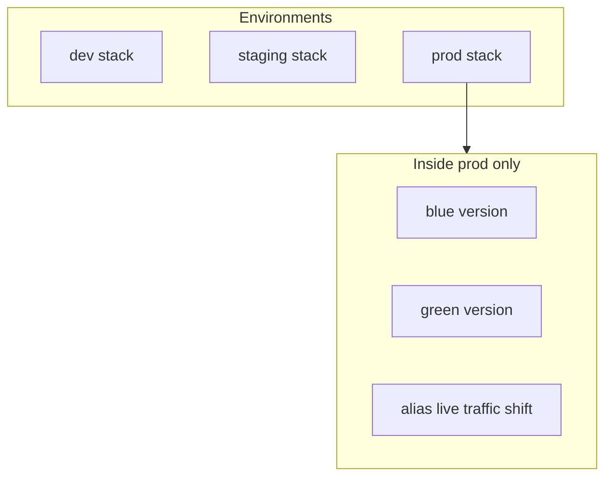

# Deployment strategies (summary)

When these strategies are **locked in**, we will capture them in an **ADR** under [adr/](./adr/) (see [adr/README.md](./adr/README.md)).

## Blue / green (per environment)

- **Terraform:** new Lambda **version**; **`live`** alias + optional **`routing_config`** weights or **CodeDeploy** (see [ARCHITECTURE.md](../ARCHITECTURE.md) §12.3).
- **GitHub Actions:** ordered **`apply`** → smoke → promote; optional environment approvals (§12.3.3, §13).

## Multiple environments

- **Isolated stacks:** `env/dev.tfvars`, `env/prod.tfvars`, … + **distinct remote state key** per env ([ARCHITECTURE.md](../ARCHITECTURE.md) §12.4).
- **Blue/green is not “dev vs prod”:** it is **version rotation inside one env** (e.g. prod).

## Pragmatic CI auth (default plan)

- **Plan-only CI:** no AWS keys ([ARCHITECTURE.md](../ARCHITECTURE.md) §13.1.2–13.1.3).
- **`apply`:** narrow IAM user in secrets **or** one simple OIDC role; skip per-env OIDC claim matrix unless you adopt multi-account.

