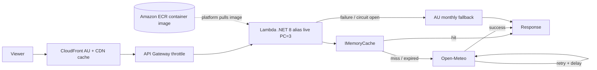

# System context

High-level traffic and components. See [ARCHITECTURE.md](../ARCHITECTURE.md) §2.

**Deploy path:** the API runs as a **Lambda container image** built from the repo **Dockerfile** and stored in **Amazon ECR**; Lambda pulls that image when environments start or scale.

