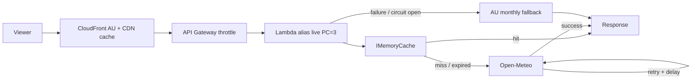

# System context

High-level traffic and components. See [ARCHITECTURE.md](../ARCHITECTURE.md) §2.

```mermaid
flowchart LR
  V[Viewer]
  CF[CloudFront AU + CDN cache]
  GW[API Gateway throttle]
  L[Lambda alias live PC=3]
  MEM[IMemoryCache]
  OM[Open-Meteo]
  FB[AU monthly fallback]

  V --> CF --> GW --> L
  L --> MEM
  MEM -->|miss / expired| OM
  MEM -->|hit| R[Response]
  OM -->|success| R
  OM -->|retry + delay| OM
  L -->|failure / circuit open| FB
  FB --> R
```
