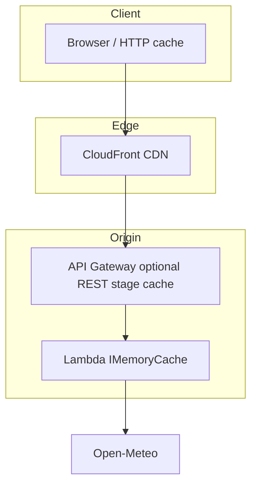

# Caching layers

Logical cache stack for `GET /weather`. See [ARCHITECTURE.md](../ARCHITECTURE.md) §7 and §11.3.7 (correlation id vs CDN body cache).

**Notes:** HTTP API has no native stage cache like REST; “API tier” cache may be Lambda-only. `/weather` may skip shared CDN body cache when `correlationId` is in JSON (see architecture doc).
