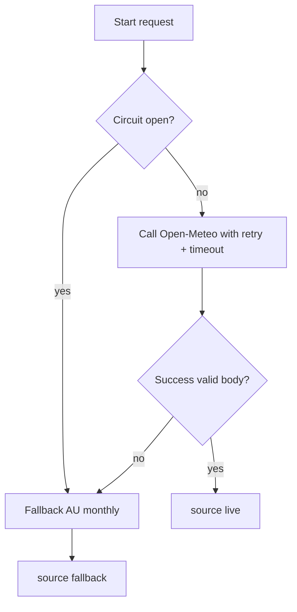

# Open-Meteo path — resilience

Retries, circuit breaker, and fallback (AU monthly table). See [ARCHITECTURE.md](../ARCHITECTURE.md) §5–§6 and §8.

```mermaid
flowchart TD
  A[Start request] --> B{Circuit open?}
  B -->|yes| F[Fallback AU monthly]
  B -->|no| C[Call Open-Meteo with retry + timeout]
  C --> D{Success valid body?}
  D -->|yes| E[source live]
  D -->|no| F
  F --> G[source fallback]
```
