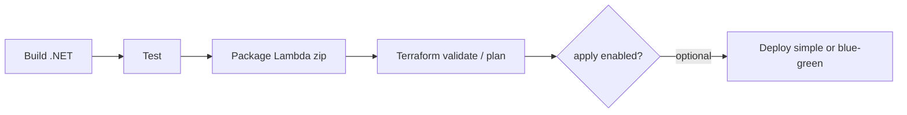

# CI/CD stages

GitHub Actions pipeline (logical order). See [ARCHITECTURE.md](../ARCHITECTURE.md) §13.

```mermaid
flowchart LR
  A[Build .NET] --> B[Test]
  B --> C[Package Lambda zip]
  C --> D[Terraform validate / plan]
  D --> E{apply enabled?}
  E -->|optional| F[Deploy simple or blue-green]
```
