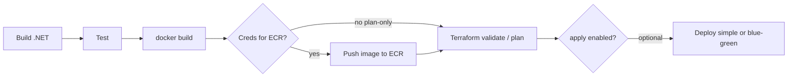

# CI/CD stages

GitHub Actions pipeline (logical order). See [ARCHITECTURE.md](../ARCHITECTURE.md) §13.

**Package path:** **Docker** image for **Lambda (container)** → **Amazon ECR**; Terraform consumes the **image URI / digest** (e.g. `TF_VAR_container_image`). **Push to ECR** may be limited to protected branches or workflows with AWS credentials.

**Plan-only PRs:** you may run **`docker build`** + **`terraform plan`** without **ECR push** by passing a **placeholder or stable** `TF_VAR_*` image string — document the split in the README so reviewers know what runs without AWS keys.
