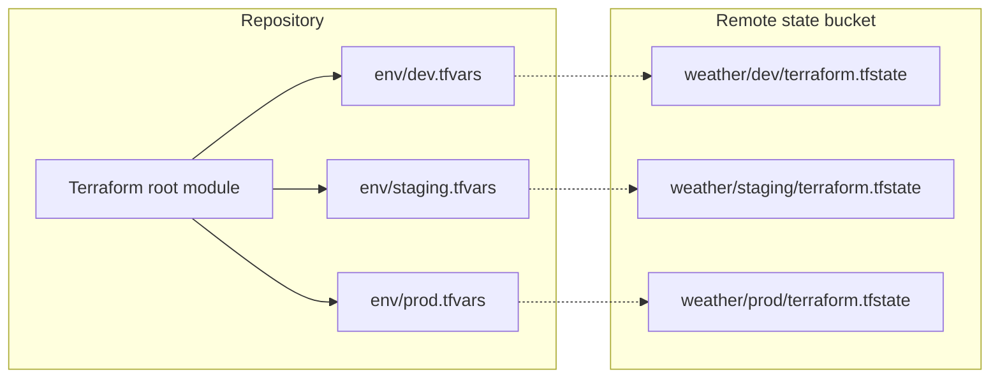

# Terraform — multiple environments

Per-environment `tfvars` and remote state keys. See [ARCHITECTURE.md](../ARCHITECTURE.md) §12.4.

```mermaid
flowchart LR
  subgraph repo[Repository]
    TF[Terraform root module]
    D[env/dev.tfvars]
    S[env/staging.tfvars]
    P[env/prod.tfvars]
  end
  subgraph state[Remote state bucket]
    SD[weather/dev/terraform.tfstate]
    SS[weather/staging/terraform.tfstate]
    SP[weather/prod/terraform.tfstate]
  end
  TF --> D
  TF --> S
  TF --> P
  D -.-> SD
  S -.-> SS
  P -.-> SP
```
